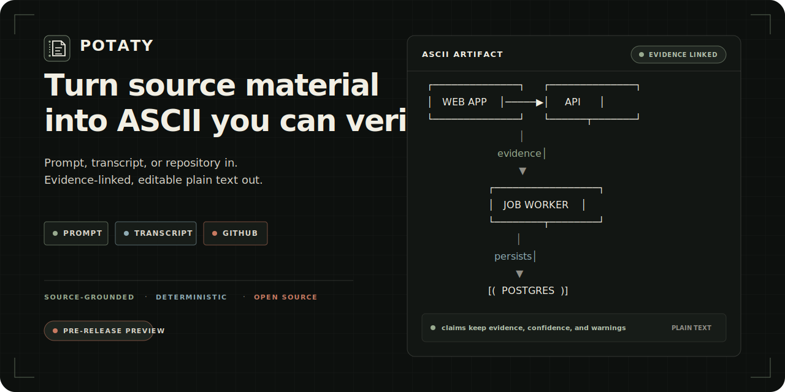
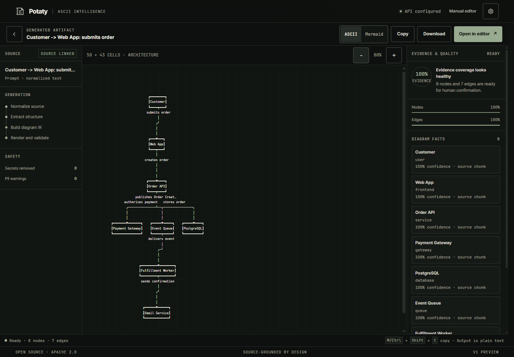
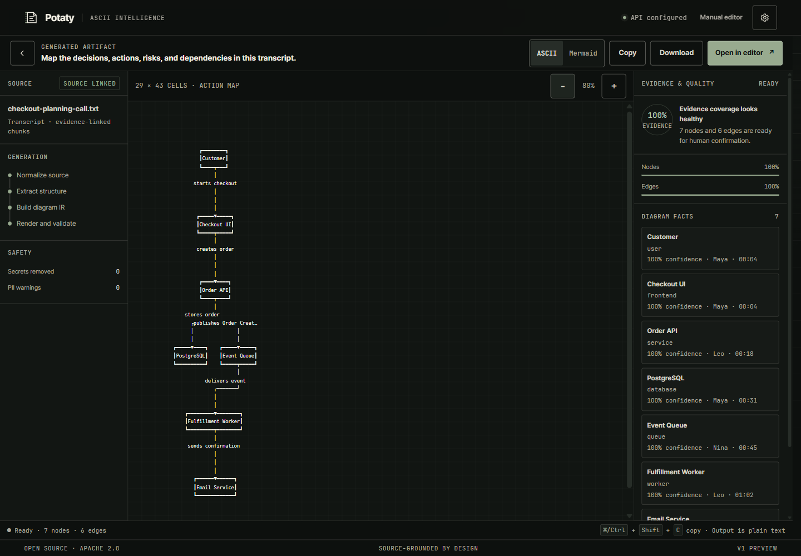
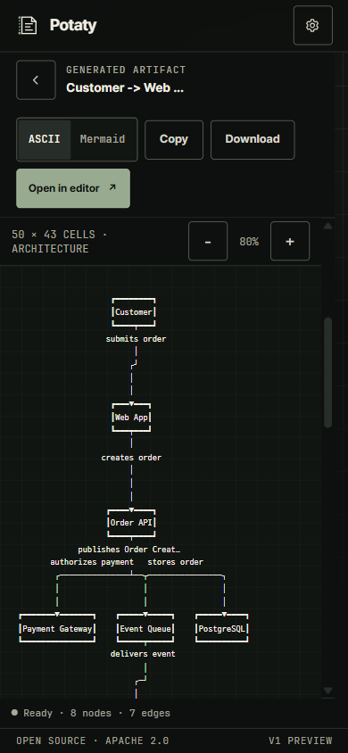
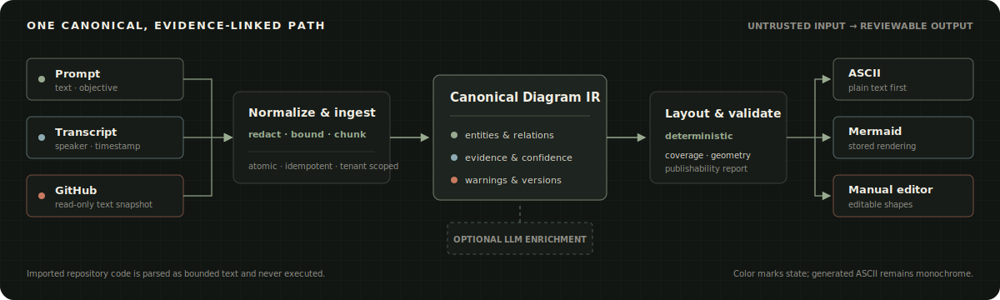

# Potaty

<p align="center">
  
</p>

<p align="center"><strong>Source in. Verifiable ASCII out.</strong></p>

<p align="center">
  <a href="https://github.com/potatohoney-p/potaty/actions/workflows/ci.yml"></a>
  <a href="LICENSE"></a>
  <a href="https://kotlinlang.org/"></a>
  
</p>

Potaty turns untrusted prompts, text transcripts, and GitHub repositories into editable ASCII
diagrams. Every result retains source evidence, confidence, warnings, and a deterministic
renderer-independent Diagram IR.

> [!IMPORTANT]
> Potaty is ready for local development and controlled self-hosted evaluation. It is not yet a
> public hosted multi-tenant service. Never expose development bearer-token mode to the internet.
> See the [roadmap](docs/ROADMAP.md) for the production gate.

## One workflow for three kinds of source

| Input | What you provide | What Potaty preserves |
|---|---|---|
| Prompt | A system, process, or set of relationships | Normalized source chunks and claim references |
| Transcript | UTF-8 `.txt`, `.md`, `.markdown`, or `.log`, up to 2 MiB | File, speaker, timestamp, and source spans |
| GitHub | A public `github.com/{owner}/{repo}` URL or configured GitHub App | Commit, ref, path, line range, and truncation warnings |

All three flows produce the same versioned Diagram IR. The workbench renders ASCII first and
Mermaid second, with evidence coverage, warnings, copy, download, zoom, and insertion into the
manual editor.

## See the real product

These screenshots come from the production Kotlin/JS bundle running against the local Ktor API.
They use synthetic English input.



<p align="center"><sub>Prompt → normalized source → grounded Diagram IR → ASCII result and evidence inspector</sub></p>

<table>
  <tr>
    <td width="68%"></td>
    <td width="32%"></td>
  </tr>
  <tr>
    <td align="center"><sub>English transcript → action map</sub></td>
    <td align="center"><sub>390 px responsive result</sub></td>
  </tr>
</table>

## Why the output is reviewable

- **Evidence stays attached.** Nodes and relations point back to source chunks.
- **Uncertainty stays visible.** Confidence, inferred claims, warnings, and coverage are part of the artifact.
- **The core is deterministic.** Canonical IR, layout, Unicode cell measurement, and ASCII rendering have repeatable outputs and golden tests.
- **Imported repositories are never executed.** Potaty reads selected, bounded text files as untrusted data. It does not install dependencies, build, or run imported code.
- **Retries preserve one operation.** Request-bound idempotency, atomic persistence, worker fencing, and browser recovery prevent duplicate snapshots and provider work.
- **Tenant boundaries are explicit.** Every tenant-owned backend operation is workspace-scoped.

## How data moves



1. The backend bounds, normalizes, safety-scans, and chunks the source.
2. Source, initial version, and evidence commit atomically under a request-bound idempotency key.
3. Deterministic extractors build entities and relations. Optional provider enrichment can assist sparse prose when an operator explicitly configures it.
4. Diagram IR validation records evidence coverage, confidence, inferred claims, and warnings.
5. Potaty persists the immutable artifact and requested renderings before the browser lays out the ASCII result.

Read [Architecture](docs/ARCHITECTURE.md), [Security](SECURITY.md), and
[Privacy](docs/PRIVACY.md) before using real data.

## Quick start

### Prerequisites

- JDK 17
- Node.js 22 LTS or newer
- npm 10+
- Chrome or Chromium

### 1. Clone and install

```bash
git clone https://github.com/potatohoney-p/potaty.git
cd potaty
npm ci
```

### 2. Start the local API

```bash
export POTATY_PORT=8090
export POTATY_AUTH_MODE=dev
export POTATY_DEV_AUTH=true
export POTATY_DEV_TOKEN="$(node -e 'console.log(require("node:crypto").randomBytes(32).toString("hex"))')"
export POTATY_DEV_PROJECT_ID=00000000-0000-0000-0000-000000000010
export POTATY_CREDENTIAL_KMS_KEY="$(node -e 'console.log(require("node:crypto").randomBytes(32).toString("hex"))')"
./gradlew :backend:run
```

<details>
<summary>PowerShell equivalent</summary>

```powershell
$env:POTATY_PORT = "8090"
$env:POTATY_AUTH_MODE = "dev"
$env:POTATY_DEV_AUTH = "true"
$env:POTATY_DEV_TOKEN = node -e "console.log(require('node:crypto').randomBytes(32).toString('hex'))"
$env:POTATY_DEV_PROJECT_ID = "00000000-0000-0000-0000-000000000010"
$env:POTATY_CREDENTIAL_KMS_KEY = node -e "console.log(require('node:crypto').randomBytes(32).toString('hex'))"
.\gradlew.bat :backend:run
```

</details>

### 3. Start the Studio

```bash
./gradlew browserDevelopmentRun --continuous --no-parallel
```

On Windows, use `.\gradlew.bat browserDevelopmentRun --continuous --no-parallel`.

Open the URL printed by Gradle, then enter the following under **Runtime settings**:

- **API origin:** `http://localhost:8090`
- **Access token:** the generated `POTATY_DEV_TOKEN`
- **Project ID:** `00000000-0000-0000-0000-000000000010`

The access token stays only in page memory and is cleared on reload. For PostgreSQL and Docker
Compose setup, see [Deployment](docs/DEPLOYMENT.md).

## Available today

| Area | Current preview |
|---|---|
| Generation | Prompt, pasted text, UTF-8 transcript, public GitHub, and configured private GitHub App input |
| Output | ASCII, Mermaid, evidence inspector, warnings, copy, download, zoom, and manual editing |
| Backend | Ktor API, H2 development mode, Flyway PostgreSQL/pgvector infrastructure, jobs, quotas, audit foundations |
| Safety | Strict source bounds, secret redaction, terminal/bidi cleanup, tenant-scoped persistence, deterministic rendering |

Audio transcription and GitHub pull-request publishing exist as operator integration surfaces, not
finished public user flows. They require operator-owned credentials and live deployment evidence.

## Repository map

```text
app/                       Browser Studio and interaction controller
backend/                   Ktor API, jobs, persistence, providers, GitHub
libs/                      Manual ASCII editor and drawing primitives
shared/diagram-ir/         Canonical evidence-linked Diagram IR
shared/layout-engine/      Deterministic diagram layout
shared/renderer-ascii/     Whitespace-preserving ASCII renderer
shared/renderer-codegen/   Mermaid, D2, PlantUML, Graphviz, Markdown
shared/workbench-client/   Typed browser client and source orchestration
src/                       Browser entry point, styles, and fonts
docs/                      Architecture, operations, testing, and roadmap
```

## Build and verification

Run the full gate before opening a pull request:

```bash
npm ci
npm audit --audit-level=moderate
./gradlew ktlint --no-daemon --no-parallel
./gradlew test browserProductionWebpack :backend:installDist --no-daemon --no-parallel
```

Windows uses `gradlew.bat`. The latest verified release gate covers 95 suites and 518 tests with
zero failures or errors, a zero-finding moderate npm audit, the production browser bundle, backend
distribution, PostgreSQL contract testing in CI, and a hardened container smoke test. See
[Testing](docs/TESTING.md) and the live [CI workflow](https://github.com/potatohoney-p/potaty/actions/workflows/ci.yml).

## Production scope and roadmap

The supported local prompt, text-transcript, and public-GitHub flows are suitable for an honest
open-source preview. Public hosting still requires external identity and onboarding, KMS/HSM
credential encryption, distributed abuse and spend controls, broad PostgreSQL restore evidence,
privacy operations, automated cross-browser accessibility, and a production deployment canary.

The [risk-ordered roadmap](docs/ROADMAP.md) defines the acceptance evidence for `0.1.x`, `0.2.x`,
`0.3.x`, and a hosted `1.0`.

## Documentation

| Audience | Start here |
|---|---|
| Users and self-hosters | [Deployment](docs/DEPLOYMENT.md) · [Troubleshooting](docs/TROUBLESHOOTING.md) · [Privacy](docs/PRIVACY.md) |
| Contributors | [Contributing](CONTRIBUTING.md) · [Architecture](docs/ARCHITECTURE.md) · [Design system](docs/DESIGN.md) · [Testing](docs/TESTING.md) |
| Maintainers | [Releasing](docs/RELEASING.md) · [Asset provenance](docs/assets/README.md) · [Changelog](CHANGELOG.md) |
| Security and governance | [Security policy](SECURITY.md) · [Code of Conduct](CODE_OF_CONDUCT.md) · [Third-party notices](THIRD_PARTY_NOTICES.md) |

## Contributing

Bug reports, documentation fixes, tests, and focused feature contributions are welcome. Read
[CONTRIBUTING.md](CONTRIBUTING.md) first and use synthetic fixtures. Security reports must follow
the private process in [SECURITY.md](SECURITY.md).

## Attribution and licence

Potaty is licensed under the [Apache License 2.0](LICENSE).

The manual ASCII editor foundation is derived from
[MonoSketch](https://github.com/tuanchauict/MonoSketch), also under Apache-2.0. Potaty retains the
upstream source notices in [NOTICE](NOTICE) and [THIRD_PARTY_NOTICES.md](THIRD_PARTY_NOTICES.md).

Samsung Sharp Sans is proprietary and is not distributed in this repository. Potaty uses it only
when a licensed local or deployment-provided copy exists, then falls back to bundled open fonts.
